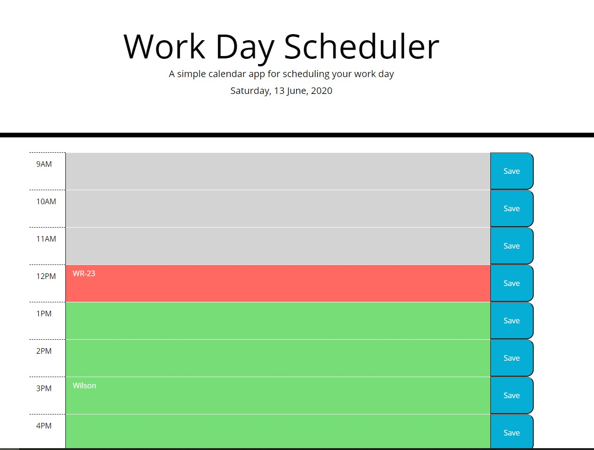

# 5-Day-Planner

This is a practice Code Quiz function for Bootcamp Student.

# Instruction 

This is a simple calendar application that allows users to save events for each hour from 9AM to 5PM.  Users can only save by clicking on the blue save button.  

# About this application

The application adapts to multiple screen sizes and powered by jQuery.  The calendar displays stardard busniess hours from 9 AM to 5 PM.  There are a total of 9 rows for each hour.  Each has its only time display, a field to save user input, and a save button.  All the information saved will be stored into `localStorage`.  Each row will show a different color.  Please see below for each color statement: 

Grey represents the past time. 

Red represents the current time. 

Green represents the future time. 

# Header 

The header displays the current date and will change to display the current date.

# The URL of the deployed application

https://wilsonruan.github.io/5-Day-Planner/

# The URL of the GitHub repository

https://github.com/Wilsonruan/5-Day-Planner 